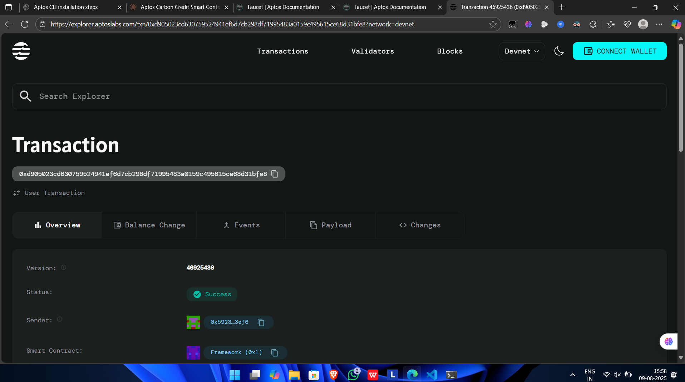

Carbon Credit Registry
Project Title
Carbon Credit Registry - Verified Carbon Credit Trading System
Project Description
The Carbon Credit Registry is a blockchain-based smart contract system built on the Aptos network that enables verified carbon credit trading. This decentralized platform allows organizations and individuals to register their verified carbon credits, set pricing, and facilitate secure peer-to-peer trading of carbon offsets. The system ensures transparency, traceability, and authenticity in carbon credit transactions, contributing to global climate action initiatives.
Project Vision
Our vision is to create a transparent, efficient, and accessible carbon credit marketplace that accelerates global climate action. By leveraging blockchain technology, we aim to:

Democratize Access: Make carbon credit trading accessible to organizations of all sizes
Ensure Transparency: Provide immutable records of all carbon credit transactions
Prevent Double Spending: Eliminate the risk of selling the same carbon credit multiple times
Promote Trust: Build confidence in carbon offset programs through verified, traceable credits
Support Climate Goals: Facilitate easier participation in carbon neutrality and net-zero initiatives

Key Features
🌱 Verified Credit Registration

Organizations can register their verified carbon credits on the blockchain
Set custom pricing per carbon credit unit
Maintain transparent records of total and available credits

💰 Secure Trading System

Peer-to-peer carbon credit purchasing using APT tokens
Automatic validation of credit availability before transactions
Instant settlement and ownership transfer

🔒 Blockchain Security

Immutable transaction records on the Aptos blockchain
Smart contract-enforced business logic
Protection against fraudulent transactions

📊 Transparent Tracking

Real-time visibility of credit ownership and availability
Complete transaction history for audit purposes
Clear differentiation between owned and tradeable credits

Future Scope
Phase 2 Enhancements

Multi-token Support: Accept various cryptocurrencies for carbon credit purchases
Fractional Trading: Enable trading of partial carbon credit units
Automated Verification: Integration with IoT devices for automatic credit generation

Phase 3 Expansion

Carbon Credit Marketplace: Full-featured marketplace with search and filtering
Reputation System: Rating system for credit issuers and buyers
Integration APIs: Connect with existing carbon management platforms

Long-term Vision

Cross-chain Compatibility: Support for multiple blockchain networks
AI-powered Pricing: Dynamic pricing based on market conditions and demand
Global Standards Integration: Compliance with international carbon credit standards (VCS, Gold Standard, etc.)
Corporate Dashboard: Advanced analytics and reporting for enterprise users

Contract Details
0xd905023cd630759524941ef6d7cb298df71995483a0159c495615ce68d31bfe8 
   